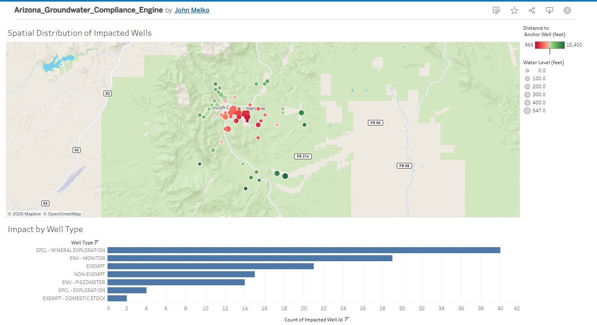

Arizona Groundwater Compliance Engine (AGCE)
Automated Spatial ETL and Dashboarding for Environmental Permitting

📖 Project Overview
In environmental consulting, establishing water rights and monitoring infrastructure for mining operations requires strict regulatory compliance. A standard requirement is assessing potential groundwater drawdown impacts on neighboring wells within a select radius of a proposed site.

Traditionally, parsing the Arizona Department of Water Resources (ADWR) registry (150,000+ records) and calculating spatial buffers is a manual, bottlenecked GIS workflow. The AGCE is an automated, reproducible data engineering pipeline that ingests raw government data, performs complex spatial transformations in a Dockerized PostGIS database, and outputs an interactive Tableau dashboard for regulatory stakeholders.

🏗️ Architecture & Tech Stack
This project operates on the principle of pushing compute to the database, utilizing a modern, decoupled data stack:

Processing Engine: DuckDB (Memory-efficient CSV parsing and type-inference handling)

Spatial Transformation: GeoPandas & Python

Database Infrastructure: Docker & PostGIS / PostgreSQL

Visualization: Tableau

⚙️ The ETL Pipeline
1. Extraction & Preprocessing (DuckDB)
The ADWR state-wide registry is a dense, often inconsistently formatted CSV. Instead of loading this into Pandas, DuckDB is used to stream the file, strictly filter for valid UTM coordinates, handle dynamic type-inference anomalies (decimals vs. integers), and compress the clean data into a lightweight .parquet file.

2. Spatial Loading (GeoPandas & SQLAlchemy)
The pipeline utilizes GeoPandas to ingest the clean Parquet file, transform raw UTM X and UTM Y fields into formalized geometries mapped to the ADWR standard coordinate reference system (EPSG:26912), and idempotently load the spatial data into the local PostGIS container.

3. Impact Analysis (PostGIS SQL)
Instead of relying on desktop GIS software, the heavy spatial math is executed directly in the database. A custom SQL script dynamically generates a 3-mile (15,840 ft) buffer around a specified anchor well (e.g., Arizona Minerals Inc. site), utilizes ST_DWithin to isolate neighboring wells, and extracts standard ST_Y and ST_X coordinates for visualization.

4. Executive Export (Pandas)
A final Python module queries the database, retrieves the isolated impact zone, and generates a clean CSV specifically formatted for Tableau's mapping engine.

📊 The Deliverable: Tableau Dashboard
The backend architecture feeds directly into an interactive front-end dashboard designed for Compliance Managers and Mine Operators.

Visual Hierarchy: Implements preattentive attributes to highlight risk. Wells are color-coded by distance to the anchor site (red = high risk/close proximity) and sized by water depth.

Interactive Filtering: Allows operators to instantly filter the impact zone by well type (Exempt vs. Non-Exempt) to assess potential regulatory exposure.

[**View the Live Interactive Dashboard on Tableau Public**]https://public.tableau.com/shared/QMWBB88QH?:display_count=n&:origin=viz_share_link

📂 Repository Structure
Plaintext
AZ-Groundwater-Compliance-Engine/
│
├── data/
│   ├── raw/                # ADWR Wells55 CSV (Ignored by Git)
│   └── processed/          # Clean Parquet and Tableau Export CSV
│
├── src/
│   ├── 02_duckdb_preprocessing.py   # Cleans and compresses raw data
│   ├── 03_load_postgis.py           # Generates geometries and pushes to DB
│   └── 04_export_impact_analysis.py # Executes spatial SQL and exports
│
├── docker-compose.yml      # PostGIS Infrastructure Blueprint
├── .gitignore              # Environment and Data shielding
└── README.md
🚀 How to Run Locally
1. Spin up the Database:

Bash
docker compose up -d
2. Build the Python Environment:

Bash
python -m venv .venv
source .venv/Scripts/activate
pip install duckdb pyarrow pandas geopandas sqlalchemy psycopg2-binary geoalchemy2
3. Execute the Pipeline:

Bash
python src/02_duckdb_preprocessing.py
python src/03_load_postgis.py
python src/04_export_impact_analysis.py